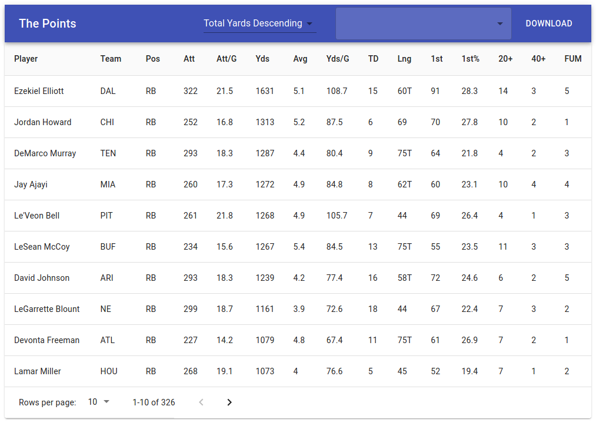

# The Points
A simple web app that is powered by Express and React to display the rushing stats found [here](https://github.com/Adriel-M/the-points/blob/master/src/server/RushingStore/rushing.json).



## Features

- Sortable by
  - Name
  - Yards
  - Longest Rush
  - Touchdowns
- Search for user with autosuggestions.
- Download data as csv.
- React
- Graphql

## Getting Started

### Running a dev environment

```
npm install
npm run dev
```

This project uses `nodemon` to auto reload the `express` app and `webpack` to rebuild the `react` app.

### Running a production environment

```
npm ci
npm run build
npm run start
```

This will build (bundle and minify) the frontend code and place it in the `build` folder. Running `start` will start up the express server that exposes the `graphql` endpoints and servers the built webapp.

### Deploying

This projects includes a `Procfile` to deploy to heroku. A Dockerfile is also
supplied.

## Built With

- [React](https://github.com/facebook/react)
- [Material Ui](https://github.com/mui-org/material-ui)
- [Express](https://github.com/expressjs/express)
- [Express Graphql](https://github.com/graphql/express-graphql)

## License

This project is licensed under the MIT License - see the [LICENSE](LICENSE) file for details.
